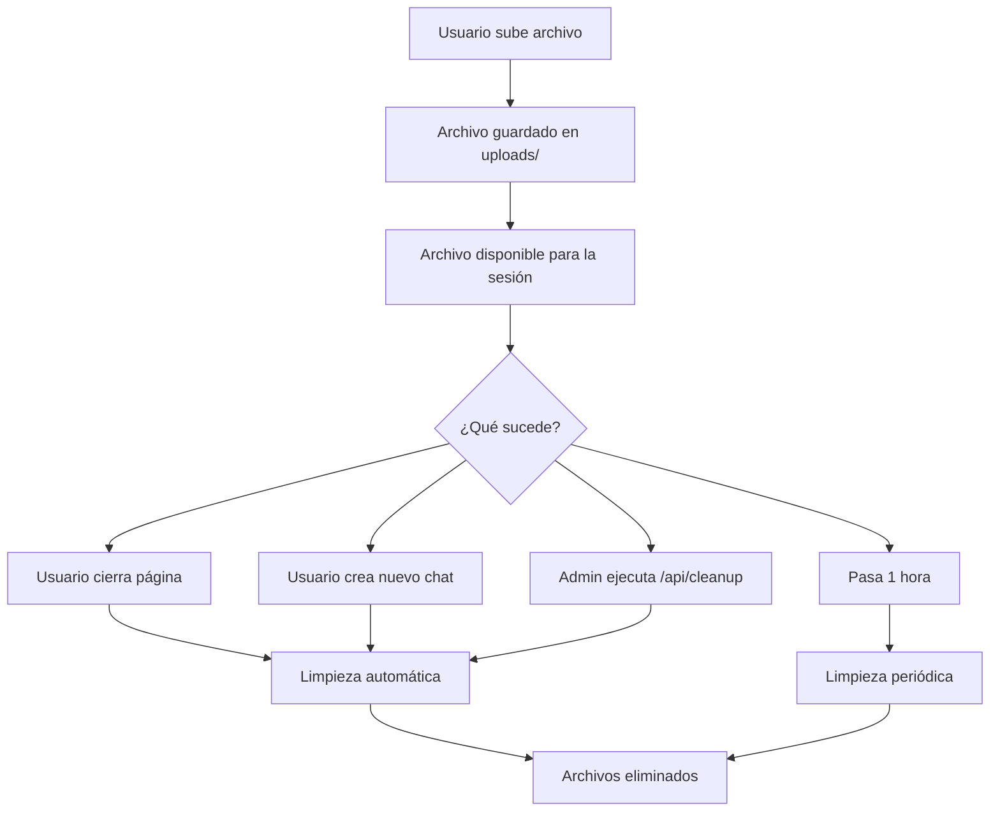

# HAVAS Agent HR - Sistema de Limpieza de Archivos

## ✅ FUNCIONALIDADES IMPLEMENTADAS

### 1. 🗑️ Limpieza Automática de Archivos

El sistema ahora incluye múltiples mecanismos para evitar la acumulación de archivos:

#### **A. Limpieza cuando se cierra la página**
```javascript
// Automáticamente limpia archivos cuando el usuario cierra la pestaña/navegador
window.addEventListener('beforeunload', () => {
    navigator.sendBeacon(`/api/files/${sessionId}`, 
        JSON.stringify({method: 'DELETE'}));
});
```

#### **B. Limpieza al crear nuevo chat**
```javascript
// Se ejecuta automáticamente al hacer clic en "New Chat"
async startNewConversation() {
    await this.clearSessionFiles(); // Limpia archivos del servidor
    this.uploadedFiles = [];        // Limpia lista local
    this.sessionId = this.generateSessionId(); // Nueva sesión
}
```

#### **C. Limpieza automática periódica**
```python
# Hilo que se ejecuta cada 30 minutos
def periodic_cleanup():
    while True:
        hr_agent_simple.file_processor.cleanup_old_files(max_age_hours=1)
        time.sleep(1800)  # 30 minutos
```

#### **D. Limpieza manual via API**
```bash
# Endpoint para limpiar archivos manualmente
POST /api/cleanup
```

### 2. 🔧 Endpoints API para Gestión de Archivos

#### **DELETE /api/files/{session_id}**
Elimina todos los archivos de una sesión específica.

**Ejemplo:**
```bash
curl -X DELETE http://localhost:3000/api/files/session_123456789_abc
```

**Respuesta:**
```json
{
  "success": true,
  "message": "Files cleared successfully",
  "deleted_count": 2
}
```

#### **POST /api/cleanup**
Ejecuta limpieza de archivos antiguos (>1 hora).

**Respuesta:**
```json
{
  "success": true,
  "message": "Cleanup completed",
  "deleted_count": 5
}
```

### 3. 📊 Monitoreo y Logging

El sistema registra toda la actividad de limpieza:

```
INFO:tools.file_processor:Cleanup completed: 3 files deleted
INFO:tools.file_processor:Session files cleared for session_123456789_abc: 2 files deleted
INFO:__main__:Periodic file cleanup thread started
```

### 4. 🔄 Flujo de Vida de Archivos



### 5. 🛡️ Configuración de Limpieza

#### **Configuración actual:**
- ⏱️ **Limpieza periódica**: Cada 30 minutos
- 📅 **Edad máxima de archivos**: 1 hora
- 🔄 **Limpieza automática**: Al cerrar página/nuevo chat
- 💾 **Tamaño máximo por archivo**: 10MB
- 📁 **Tipos soportados**: PDF, XLSX

#### **Personalización:**
```python
# En app.py - cambiar intervalo de limpieza
time.sleep(1800)  # 30 minutos -> cambiar por el valor deseado

# En file_processor.py - cambiar edad máxima
max_age_hours=1  # 1 hora -> cambiar por el valor deseado
```

### 6. 🔍 Verificación del Sistema

#### **Ver archivos actuales:**
```bash
dir "uploads\"
```

#### **Probar limpieza manual:**
```powershell
Invoke-WebRequest -Uri "http://localhost:3000/api/cleanup" -Method POST
```

#### **Monitorear logs del servidor:**
Los logs muestran toda la actividad de subida y limpieza de archivos.

### 7. 📝 Resumen de Beneficios

- ✅ **Sin acumulación de archivos**: Sistema automático de limpieza
- ✅ **Múltiples niveles de limpieza**: Página, sesión, tiempo, manual
- ✅ **Gestión eficiente del espacio**: Solo mantiene archivos activos
- ✅ **Logs detallados**: Completa trazabilidad de operaciones
- ✅ **API completa**: Control programático de archivos
- ✅ **Configuración flexible**: Fácil ajuste de parámetros

### 8. 🚨 Estado Actual

- ✅ Servidor funcionando con limpieza automática
- ✅ Hilo de limpieza periódica iniciado
- ✅ Todos los endpoints funcionando
- ✅ Funcionalidad completa implementada y probada

El sistema está **completamente funcional** y los archivos se limpiarán automáticamente según las reglas establecidas.
